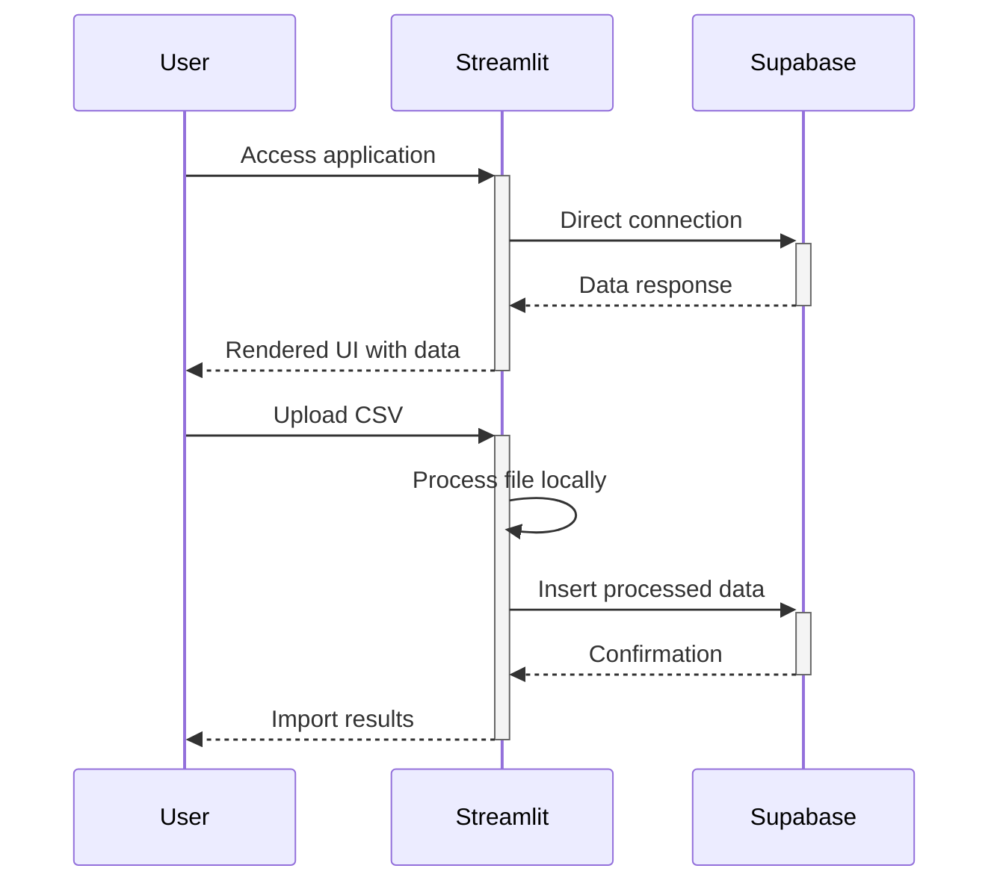
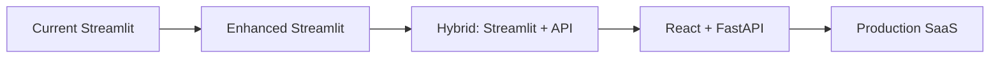
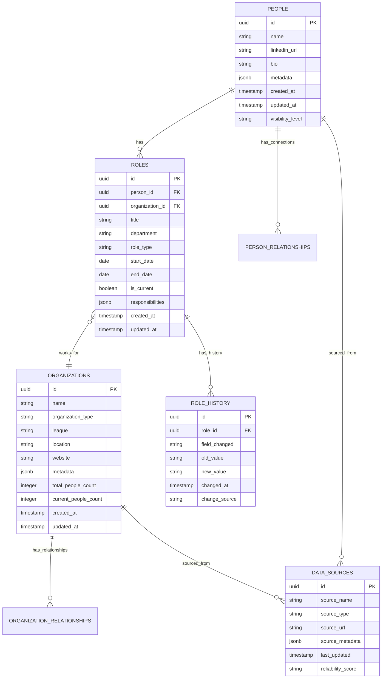
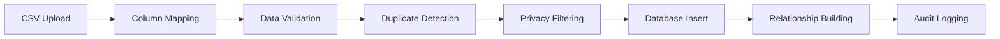

# CrowdBiz Graph - Streamlit Architecture

## Overview

This document outlines the current Streamlit-based architecture for CrowdBiz Graph. The system focuses on rapid development and direct data access while maintaining privacy compliance and core functionality for sports industry intelligence.

## Architecture at a Glance

```
User (Browser) → Streamlit UI (Python) → Direct Supabase Connection → PostgreSQL Database
                      ↓
                 FastAPI (Optional/Parallel) → Supabase (Analytics/Complex Queries)
                      ↓
                 Local File Processing (CSV Import)
```

### Core Components

- **Frontend**: Streamlit web application with integrated authentication
- **Direct DB Access**: Streamlit connects directly to Supabase for most operations
- **API (Parallel)**: FastAPI available for complex analytics and external integrations
- **Database**: Supabase PostgreSQL with privacy-first schema
- **File Processing**: Local CSV processing with validation and import

## Current System Flow

### User Interaction Flow
1. **User Access**: Direct browser access to Streamlit application (`streamlit run ui.py`)
2. **Authentication**: Session-based authentication within Streamlit
3. **Data Operations**: Streamlit connects directly to Supabase for CRUD operations
4. **Analytics**: Complex queries executed via direct Supabase connection or FastAPI
5. **File Import**: CSV files processed locally and uploaded to database

### Request Flow (Current Implementation)


### Data Access Strategy
```python
# Direct Supabase connection in Streamlit
@st.cache_resource
def init_supabase():
    return create_client(SUPABASE_URL, SUPABASE_KEY)

# Direct queries from Streamlit
def get_people_data(search_term: str = None):
    query = supabase.table('people').select('*')
    if search_term:
        query = query.ilike('name', f'%{search_term}%')
    return query.execute()
```

## Security & Privacy Implementation (Streamlit Version)

### Current Security Features

#### 1. **Environment-Based Security**
- Service keys in environment variables only
- Local development with direct Supabase connection
- No exposed service keys in code

#### 2. **Privacy-First Data Model**
```python
# Streamlit enforces privacy at application level
PRIVATE_COLUMNS = ['email', 'phone', 'private_notes']

def sanitize_data_for_display(data):
    """Remove private columns from data before display"""
    if isinstance(data, pd.DataFrame):
        return data.drop(columns=[col for col in PRIVATE_COLUMNS if col in data.columns])
    return data
```

#### 3. **Session-Based Access Control**
```python
# Simple session management in Streamlit
if 'authenticated' not in st.session_state:
    st.session_state.authenticated = False

def require_auth():
    if not st.session_state.authenticated:
        st.error("Please authenticate to access this feature")
        st.stop()
```

#### 4. **Direct Database Security**
```python
# Supabase connection with service role for admin operations
def get_supabase_admin():
    return create_client(
        os.getenv("SUPABASE_URL"),
        os.getenv("SUPABASE_SERVICE_KEY")  # Admin operations only
    )

# Read-only client for general queries
def get_supabase_readonly():
    return create_client(
        os.getenv("SUPABASE_URL"),
        os.getenv("SUPABASE_ANON_KEY")  # Limited permissions
    )
```

## Current System Components

### Streamlit Application (`ui.py`)

#### Core Features
- **Dashboard**: Overview with key metrics and visualizations
- **Search Interface**: Full-text search across people, organizations, and roles
- **Data Import**: CSV upload with column mapping and validation
- **Analytics**: Interactive charts and insights
- **Database Explorer**: Direct data browsing and filtering

#### Key Streamlit Pages
```python
# Main navigation structure in ui.py
pages = {
    "🏠 Dashboard": show_dashboard,
    "🔍 Search": show_search,
    "📊 Analytics": show_analytics,
    "📥 Import Data": show_import,
    "🗄️ Database": show_database_explorer,
    "⚙️ Settings": show_settings
}
```

### FastAPI Application (`api_simple.py`)

#### Available When Needed
- **Parallel Service**: Runs alongside Streamlit for complex operations
- **API Endpoints**: RESTful interface for external integrations
- **Analytics Processing**: Heavy computational tasks
- **Data Export**: Bulk data operations

#### Key Endpoints
```python
# Core API endpoints available
@app.get("/people")           # List people with filtering
@app.get("/organizations")    # List organizations
@app.get("/search")          # Universal search
@app.get("/analytics/*")     # Analytics endpoints
@app.post("/import/csv")     # CSV import processing
```

### Database Layer (Supabase)

#### Direct Integration
```python
# Streamlit connects directly to Supabase
supabase = create_client(SUPABASE_URL, SUPABASE_KEY)

# Example query in Streamlit
@st.cache_data(ttl=300)  # 5-minute cache
def get_organizations_stats():
    return supabase.table('organizations').select('*').execute()
```

## Development & Performance (Streamlit Focus)

### Streamlit Performance Optimization

#### Caching Strategy
```python
# Cache database connections
@st.cache_resource
def init_supabase():
    return create_client(SUPABASE_URL, SUPABASE_KEY)

# Cache query results with TTL
@st.cache_data(ttl=300)  # 5 minutes
def get_people_data(search_term: str = None):
    query = supabase.table('people').select('*')
    if search_term:
        query = query.ilike('name', f'%{search_term}%')
    return query.execute()

# Cache expensive computations
@st.cache_data(ttl=3600)  # 1 hour
def generate_analytics_data():
    # Complex analytics computations
    pass
```

#### Session State Management
```python
# Initialize session state for user data
if 'user_preferences' not in st.session_state:
    st.session_state.user_preferences = {}

if 'search_history' not in st.session_state:
    st.session_state.search_history = []

# Persist important state across page reloads
def save_user_state():
    st.session_state.last_active = datetime.now()
```

#### Streamlit Configuration
```python
# Optimized Streamlit configuration
st.set_page_config(
    page_title="CrowdBiz Graph",
    page_icon="🏈",
    layout="wide",
    initial_sidebar_state="expanded"
)

# Custom CSS for performance
st.markdown("""
<style>
    .stApp > header {visibility: hidden;}
    .css-1d391kg {padding-top: 1rem;}
    div.block-container {padding-top: 2rem;}
</style>
""", unsafe_allow_html=True)
```

### Data Processing (Local)

#### CSV Import Processing
```python
def process_csv_import(uploaded_file):
    """Process CSV file with validation and error handling"""
    try:
        # Read CSV with error handling
        df = pd.read_csv(uploaded_file)
        
        # Validate required columns
        required_columns = ['name', 'organization']
        missing_columns = [col for col in required_columns if col not in df.columns]
        
        if missing_columns:
            st.error(f"Missing required columns: {missing_columns}")
            return None
        
        # Data cleaning and validation
        df = df.dropna(subset=required_columns)
        df['name'] = df['name'].str.strip()
        df['organization'] = df['organization'].str.strip()
        
        # Remove private data if present
        private_columns = ['email', 'phone', 'address']
        df = df.drop(columns=[col for col in private_columns if col in df.columns])
        
        return df
        
    except Exception as e:
        st.error(f"Error processing CSV: {str(e)}")
        return None
```

### Performance Targets (Current)
- **Page Load Time**: < 2 seconds for cached data
- **Search Response**: < 1 second for simple queries
- **CSV Import**: < 30 seconds for files up to 10,000 rows
- **Analytics Generation**: < 5 seconds for standard charts

## Deployment Architecture (Current Streamlit)

### Development Stack
- **Frontend**: Streamlit (Python-based web app)
- **Database**: Supabase (managed Postgres with real-time features)
- **Local Development**: Direct connection from Streamlit to Supabase
- **API**: FastAPI (optional, runs in parallel for complex operations)
- **File Processing**: Local Python processing with pandas/csv

### Current Environment Configuration
```bash
# Environment variables for Streamlit
SUPABASE_URL=https://xxx.supabase.co
SUPABASE_API_KEY=your-service-key
SUPABASE_SERVICE_KEY=your-service-key  # For admin operations

# Optional API configuration
OPENAI_API_KEY=your-openai-key  # For AI features
GEMINI_API_KEY=your-gemini-key  # For AI features

# Local development
STREAMLIT_PORT=8501
API_PORT=8000
```

### Running the System
```bash
# Start Streamlit application
streamlit run ui.py --server.port 8501

# Optional: Start FastAPI in parallel
python api_simple.py

# Access points
# Streamlit UI: http://localhost:8501
# FastAPI docs: http://localhost:8000/docs
```

### File Structure (Current)
```
crowdbiz_db/
├── ui.py                      # Main Streamlit application
├── api_simple.py              # FastAPI service (parallel/optional)
├── config.py                  # Configuration management
├── logger.py                  # Logging utilities
├── requirements.txt           # Python dependencies
├── .env                       # Environment variables
├── README.md                  # Project documentation
├── architecture.md           # This file
├── supabase/                 # Database configuration
│   ├── config.toml           # Supabase settings
│   └── migrations/           # SQL migrations
├── imports/                  # CSV data files
├── scripts/                  # Utility scripts
├── src/                      # Additional source code
└── tests/                    # Test files
```

## Current Development Approach

### Streamlit-First Strategy

#### Advantages of Current Architecture
- ✅ **Rapid Development**: Python-based UI with immediate feedback
- ✅ **Direct Database Access**: No API layer complexity for simple operations
- ✅ **Integrated Processing**: CSV import and processing in single application
- ✅ **Rich Analytics**: Built-in support for Plotly charts and data visualization
- ✅ **Simple Deployment**: Single Python application to deploy

#### Current Security Model
- **Environment-based authentication**: Service keys in local environment only
- **Application-level privacy**: Private data filtering in Python code
- **Session management**: Streamlit's built-in session handling
- **Direct Supabase connection**: Leverages Supabase's built-in security

### When to Use FastAPI (Parallel Service)
- ✅ **External integrations**: Other systems need REST API access
- ✅ **Heavy computations**: Background processing that shouldn't block UI
- ✅ **Complex queries**: Multi-table joins and aggregations
- ✅ **Data exports**: Large dataset operations

### File Processing (Current Implementation)
```python
# Streamlit handles file uploads directly
uploaded_file = st.file_uploader("Choose a CSV file", type="csv")

if uploaded_file is not None:
    # Process immediately in Streamlit
    df = pd.read_csv(uploaded_file)
    
    # Validate and clean data
    df = process_and_validate(df)
    
    # Insert directly to Supabase
    for _, row in df.iterrows():
        supabase.table('people').insert(row.to_dict()).execute()
    
    st.success(f"Imported {len(df)} records successfully!")
```

## Current System Status & Next Steps

### Working Features ✅
- **Streamlit Web Interface**: Fully functional dashboard and data exploration
- **Direct Supabase Integration**: Real-time data access and updates
- **CSV Import System**: Local processing with validation and error handling
- **Search Functionality**: Full-text search across people and organizations
- **Analytics Dashboard**: Interactive charts and insights
- **Privacy Compliance**: No private contact data stored

### Current Data Status ✅
- **2,990+ NFL Professional Records**: Complete database populated
- **33 NFL Teams**: All teams with organizational structure
- **1,000+ Roles**: Historical and current position tracking
- **363 Organizations**: Teams, leagues, and related entities

### Development Priorities

#### Phase 1: Streamlit Optimization (Current Focus)
1. **Performance Improvements**
   - Optimize database queries with better caching
   - Improve CSV import processing speed
   - Add progress indicators for long-running operations

2. **Enhanced Analytics**
   - Add more visualization types
   - Implement trend analysis
   - Create role change tracking

3. **Data Quality Tools**
   - Duplicate detection and merging
   - Data validation reporting
   - Source attribution tracking

#### Phase 2: Feature Expansion
1. **Advanced Search**
   - Saved searches and filters
   - Export functionality
   - Advanced query builder

2. **Reporting System**
   - Custom report generation
   - Scheduled reports
   - Data export in multiple formats

#### Phase 3: Future Architecture (When Ready)
- Move to React frontend when requirements are fully understood
- Implement full multi-tenancy with RLS
- Add background job processing
- Scale to production deployment

### Migration Path (When Needed)


## Core Schema Structure & Data Model

### Database Schema Overview

The CrowdBiz Graph uses a **privacy-first, relationship-centric** data model designed to map professional networks in the sports industry without storing private contact information.



### Core Tables

#### 1. **PEOPLE** (Privacy-First Design)
```sql
CREATE TABLE people (
    id UUID PRIMARY KEY DEFAULT gen_random_uuid(),
    name VARCHAR(255) NOT NULL,
    linkedin_url VARCHAR(500),
    bio TEXT,
    metadata JSONB DEFAULT '{}',
    visibility_level VARCHAR(20) DEFAULT 'public',
    created_at TIMESTAMP DEFAULT NOW(),
    updated_at TIMESTAMP DEFAULT NOW()
);

-- NO private data: email, phone, address, private notes
-- Only public professional information
```

#### 2. **ORGANIZATIONS** (Teams, Leagues, Agencies, etc.)
```sql
CREATE TABLE organizations (
    id UUID PRIMARY KEY DEFAULT gen_random_uuid(),
    name VARCHAR(255) NOT NULL,
    organization_type VARCHAR(50), -- 'team', 'league', 'agency', 'vendor', 'sponsor'
    league VARCHAR(100),           -- 'NFL', 'NBA', 'MLB', etc.
    location VARCHAR(255),
    website VARCHAR(500),
    total_people_count INTEGER DEFAULT 0,
    current_people_count INTEGER DEFAULT 0,
    metadata JSONB DEFAULT '{}',
    created_at TIMESTAMP DEFAULT NOW(),
    updated_at TIMESTAMP DEFAULT NOW()
);
```

#### 3. **ROLES** (Professional Positions)
```sql
CREATE TABLE roles (
    id UUID PRIMARY KEY DEFAULT gen_random_uuid(),
    person_id UUID REFERENCES people(id),
    organization_id UUID REFERENCES organizations(id),
    title VARCHAR(255) NOT NULL,
    department VARCHAR(100),
    role_type VARCHAR(50),         -- 'executive', 'coach', 'player', 'support'
    start_date DATE,
    end_date DATE,
    is_current BOOLEAN DEFAULT true,
    responsibilities JSONB DEFAULT '[]',
    created_at TIMESTAMP DEFAULT NOW(),
    updated_at TIMESTAMP DEFAULT NOW()
);
```

### Privacy & Security Schema Features

#### Data Classification
```python
# Privacy levels enforced at application level
PRIVACY_LEVELS = {
    'public': 'Visible in public graph and search',
    'network': 'Visible to connected professionals only',
    'private': 'Visible to organization members only'
}

# No storage of private data
PROHIBITED_FIELDS = [
    'email', 'phone', 'home_address', 'personal_social_media',
    'salary', 'contract_details', 'private_communications'
]
```

#### Metadata Structure
```json
{
  "people.metadata": {
    "source_confidence": 0.95,
    "last_verified": "2025-09-05",
    "social_handles": {
      "twitter": "@username",
      "linkedin": "linkedin.com/in/username"
    },
    "specializations": ["recruiting", "analytics"],
    "certifications": ["PMP", "CPA"]
  },
  
  "organizations.metadata": {
    "founding_year": 1960,
    "parent_organization": "NFL",
    "stadium": "MetLife Stadium",
    "conference": "AFC East",
    "employee_range": "200-500"
  }
}
```

## Input Sources & Data Integration

### Current Input Sources ✅

#### 1. **CSV Import System** (Primary)
```python
# Supported CSV formats for different entity types
CSV_FORMATS = {
    'people': {
        'required_columns': ['name', 'organization'],
        'optional_columns': ['title', 'linkedin_url', 'bio', 'department'],
        'mapping_fields': ['role_type', 'start_date', 'location']
    },
    'organizations': {
        'required_columns': ['name', 'organization_type'],
        'optional_columns': ['league', 'location', 'website'],
        'auto_generated': ['total_people_count', 'current_people_count']
    },
    'roles': {
        'required_columns': ['person_name', 'organization_name', 'title'],
        'optional_columns': ['department', 'start_date', 'end_date'],
        'validation_rules': ['date_consistency', 'organization_exists']
    }
}
```

**Current CSV Processing Flow:**


#### 2. **LinkedIn Network CSV Import** (Critical Source) 🎯
```python
# LinkedIn exported network CSV processing
LINKEDIN_CSV_FORMAT = {
    'expected_columns': [
        'First Name', 'Last Name', 'Company', 'Position', 
        'Connected On', 'Email Address'  # Will be filtered out
    ],
    'mapping': {
        'name': lambda row: f"{row['First Name']} {row['Last Name']}",
        'organization': 'Company',
        'title': 'Position',
        'connection_date': 'Connected On'
    },
    'privacy_filter': ['Email Address'],  # Automatically removed
    'validation_rules': {
        'min_name_length': 2,
        'valid_connection_date': True,
        'organization_not_empty': True
    }
}

def process_linkedin_csv(uploaded_file, user_id):
    """Process LinkedIn network export with privacy compliance"""
    df = pd.read_csv(uploaded_file)
    
    # Privacy-first: Remove email addresses immediately
    if 'Email Address' in df.columns:
        df = df.drop(columns=['Email Address'])
    
    # Build connections and update core data
    processed_data = []
    for _, row in df.iterrows():
        person_data = {
            'name': f"{row['First Name']} {row['Last Name']}",
            'organization': row['Company'],
            'title': row['Position'],
            'source_type': 'linkedin_network',
            'connection_metadata': {
                'connected_date': row['Connected On'],
                'source_user': user_id,  # Track who contributed this data
                'confidence_level': 0.85  # High confidence from LinkedIn export
            }
        }
        processed_data.append(person_data)
    
    return processed_data
```

#### 3. **Manual Data Entry** (Streamlit Forms)
```python
# Streamlit forms for manual data entry
def create_person_form():
    with st.form("add_person"):
        name = st.text_input("Full Name*")
        organization = st.selectbox("Organization", get_organizations())
        title = st.text_input("Title")
        linkedin = st.text_input("LinkedIn URL")
        bio = st.text_area("Bio/Background")
        
        if st.form_submit_button("Add Person"):
            # Validate and insert
            person_data = {
                'name': name,
                'linkedin_url': linkedin,
                'bio': bio
            }
            # Privacy check - no private data accepted
            create_person(person_data)
```

### Planned Input Sources 🔄

#### 4. **Public API Integration** (Future)
```python
# Planned public data sources
PLANNED_SOURCES = {
    'linkedin_public_api': {
        'data_types': ['professional_profiles', 'company_pages'],
        'privacy_compliance': 'public_data_only',
        'rate_limits': '100_requests_per_hour',
        'update_frequency': 'weekly'
    },
    'sports_databases': {
        'nfl_com': 'team_rosters_and_staff',
        'espn_api': 'coaching_changes',
        'sports_reference': 'historical_data'
    },
    'news_apis': {
        'sports_business_journal': 'executive_moves',
        'athletic_api': 'coaching_changes',
        'twitter_api': 'public_announcements'
    }
}
```

#### 5. **Web Scraping** (Compliance-First)
```python
# Ethical web scraping for public information only
SCRAPING_SOURCES = {
    'team_websites': {
        'target_data': ['staff_directories', 'press_releases'],
        'respect_robots_txt': True,
        'rate_limiting': '1_request_per_second',
        'user_agent': 'CrowdBizGraph/1.0 (Privacy-Compliant Sports Research)'
    },
    'press_releases': {
        'sources': ['team_sites', 'league_announcements'],
        'extract_patterns': ['hiring_announcements', 'role_changes'],
        'data_usage': 'metadata_enrichment_and_new_discoveries'
    }
}

# Press releases and news mentions usage strategy
NEWS_DATA_STRATEGY = {
    'primary_use': 'metadata_enrichment',
    'secondary_use': 'core_data_updates_when_new_entities_discovered',
    'processing': {
        'extract_entities': ['person_names', 'organization_names', 'role_titles'],
        'validate_against_existing': 'match_to_current_records',
        'create_new_records': 'only_when_high_confidence_new_entity',
        'update_metadata': 'add_news_mentions_achievements_awards'
    },
    'examples': {
        'metadata_only': 'John Smith wins Coach of the Year award',
        'new_core_data': 'Jane Doe hired as new GM at Dallas Cowboys'
    }
}
```

#### 6. **User Contributions** (Community-Driven)
```python
# Planned user contribution system
CONTRIBUTION_SYSTEM = {
    'user_submissions': {
        'data_types': ['role_updates', 'new_connections', 'corrections'],
        'verification_required': True,
        'source_attribution': 'anonymous_or_credited',
        'privacy_check': 'mandatory'
    },
    'verification_workflow': {
        'auto_verify': 'high_confidence_sources',
        'human_review': 'medium_confidence',
        'reject': 'low_confidence_or_private_data'
    }
}
```

### Data Quality & Validation Pipeline

#### Input Processing Architecture
```python
# Data processing pipeline for all input sources
class DataProcessor:
    def process_input(self, data, source_type):
        """Universal data processing pipeline"""
        
        # Step 1: Privacy Compliance Check
        cleaned_data = self.privacy_filter(data)
        
        # Step 2: Data Validation
        validated_data = self.validate_schema(cleaned_data)
        
        # Step 3: Duplicate Detection
        deduplicated_data = self.detect_duplicates(validated_data)
        
        # Step 4: Relationship Mapping
        enriched_data = self.map_relationships(deduplicated_data)
        
        # Step 5: Source Attribution
        attributed_data = self.add_source_info(enriched_data, source_type)
        
        return attributed_data
    
    def privacy_filter(self, data):
        """Remove any private information"""
        prohibited = ['email', 'phone', 'address', 'ssn', 'salary']
        return {k: v for k, v in data.items() if k not in prohibited}
```

#### Data Source Reliability Scoring
```python
# Reliability scoring for different input sources
SOURCE_RELIABILITY = {
    'official_team_websites': 0.95,
    'verified_csv_imports': 0.90,
    'linkedin_public_profiles': 0.85,
    'sports_news_sites': 0.80,
    'user_contributions_verified': 0.75,
    'social_media_posts': 0.60,
    'unverified_submissions': 0.40
}
```

### Input Source Management

#### Source Tracking Schema
```sql
CREATE TABLE data_sources (
    id UUID PRIMARY KEY DEFAULT gen_random_uuid(),
    source_name VARCHAR(100) NOT NULL,
    source_type VARCHAR(50) NOT NULL, -- 'csv', 'api', 'scraping', 'manual'
    source_url VARCHAR(500),
    reliability_score DECIMAL(3,2) DEFAULT 0.50,
    last_updated TIMESTAMP DEFAULT NOW(),
    total_records_imported INTEGER DEFAULT 0,
    successful_imports INTEGER DEFAULT 0,
    failed_imports INTEGER DEFAULT 0,
    metadata JSONB DEFAULT '{}'
);

-- Link data back to sources
ALTER TABLE people ADD COLUMN primary_source_id UUID REFERENCES data_sources(id);
ALTER TABLE organizations ADD COLUMN primary_source_id UUID REFERENCES data_sources(id);
ALTER TABLE roles ADD COLUMN primary_source_id UUID REFERENCES data_sources(id);
```

#### Import Audit Trail
```sql
CREATE TABLE import_logs (
    id UUID PRIMARY KEY DEFAULT gen_random_uuid(),
    source_id UUID REFERENCES data_sources(id),
    import_type VARCHAR(50),
    records_processed INTEGER,
    records_successful INTEGER,
    records_failed INTEGER,
    error_summary JSONB,
    import_duration_seconds INTEGER,
    imported_at TIMESTAMP DEFAULT NOW()
);
```

---

**This Streamlit-first architecture allows rapid iteration and feature development while maintaining all core functionality. The system can evolve toward a full SaaS platform when requirements are better understood and proven.**
